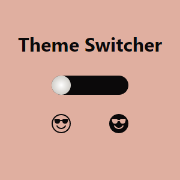

<h1>Theme Switcher</h1>

<h2>Table of contents</h2>
<ol>
    <li><a href="#section1">What is this?</a></li>
    <li><a href="#section2">Installation and setup</a></li>
    <li><a href="#section3">Project structure</a></li>
    <li><a href="#section4">Configuration</a></li>
    <li><a href="#section5">Development</a></li>
    <li><a href="#section6">Building</a></li>
    <li><a href="#section7">Functionality Overview</a></li>
    <li><a href="#section8">Styling</a></li>
    <li><a href="#section9">Metadata and SEO</a></li>
    <li><a href="#section10">Attribution</a></li>
    <li><a href="#section11">Help</a></li>
</ol>

<h2 id="section1">What is this?</h2>

This project is a theme switcher made for demo purposes.  
Depending on the user's needs, the theme may be light or dark with the use of a switch.

    

<h2 id="section2">Installation and setup</h2>

To get started, follow these steps:

<ul>
    <li>Make sure you have <code>Node.js</code> and <code>npm</code> (or <code>yarn</code>) installed.</li>
    <li>Clone the project repository</li>
    <li>Navigate to the project directory and install dependencies with <code>npm install</code> (or <code>yarn</code>).</li>
</ul>

<h2 id="section3">Project structure</h2>

The project follows the standard Angular structure:

<ul>
    <li><code>src</code> Contains the application's source code.</li>
    <li><code>assets</code> Houses static assets such as images and icons.</li>
    <li><code>app</code> Contains the main application components.</li>
</ul>

<h2 id="section4">Configuration</h2>

The <code>angular.json</code> file contains project configuration settings. It's used to define build options, environments, and more.

<h2 id="section5">Development</h2>

Run <code>ng serve</code> for a dev server. Navigate to <code>http://localhost:4200/</code>. The application will automatically reload if you change any of the source files.

<h2 id="section6">Building</h2>

Run <code>ng build</code> to build the project. The build artifacts will be stored in the <code>dist/</code> directory.

<h2 id="section7">Functionality Overview</h2>

The <code>app.component.ts</code> file contains the theme switcher functionality. The <code>goLight()</code> and <code>goDark()</code> functions toggle the theme and update the meta theme color.

<h2 id="section8">Styling</h2>

The app's styles are managed using SCSS. Global styles are defined in <code>styles.scss</code>, and component-specific styles are in their respective SCSS files. The <code>app.component.scss</code> file defines the styles for the theme switcher. Keyframe animations <code>toRight</code> and <code>toLeft</code> are used for smooth transitions.

<h2 id="section9">Metadata and SEO</h2>

The <code>index.html</code> file contains metadata and Open Graph tags for better SEO and social media sharing.

<h2 id="section10">Attribution</h2>

This project was created by <a href="https://github.com/LaetitiaBodin">Laëtitia Bodin</a>.

<h2 id="section11">Help</h2>

To get more help on the Angular CLI use <code>ng help</code> or go check out the <a href="https://angular.io/cli">Angular CLI Overview and Command Reference</a> page.
